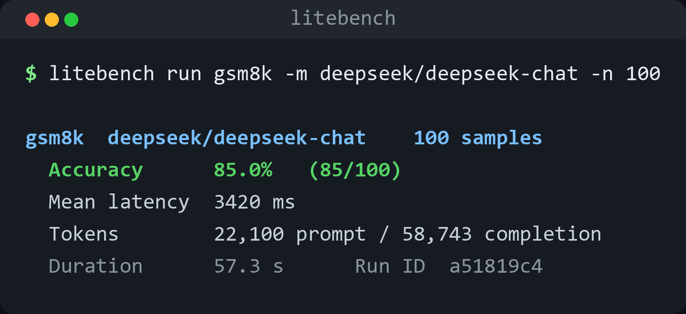

<div align="center">


[](https://pypi.org/project/litebench/)
[](https://pypi.org/project/litebench/)
[](LICENSE)

[**快速开始**](#用法) · [**内置任务**](#内置任务) · [**自定义任务**](#自定义任务) · [English](README.md)

</div>

<p align="center"></p>

## 解决什么问题

`inspect_ai` 功能强但重 —— 每个任务要自己写 Solver / Scorer。
`lm-evaluation-harness` 全但偏研究，环境配置复杂。
`promptfoo` 是给 prompt 做对比的，不是给 agent 跑 benchmark。

**LiteBench** 卡在中间这层：给应用层开发者一个轻量 CLI，在自己的模型或 agent 上跑 HumanEval / GSM8K / MMLU / MATH / TruthfulQA / ARC 这些常见任务，不用先搭框架。

```bash
pip install litebench

litebench list
litebench run gsm8k -m deepseek/deepseek-chat -n 50
litebench run humaneval -m kimi -n 20
litebench run mmlu -m claude-sonnet-4-6 --subject computer_security -n 100
litebench run math -m gpt-5 -n 50

# 自定义 YAML 任务
litebench run ./my-task.yaml -m gpt-4o-mini

# 对比不同模型
litebench runs
litebench compare <run-id-1> <run-id-2>
litebench export <run-id> -o run.json
```

## 特性

- **6 个内置任务** —— HumanEval、GSM8K、MMLU、MATH-500、TruthfulQA、ARC-Challenge。
- **100+ 模型** —— 基于 [litellm](https://github.com/BerriAI/litellm)，OpenAI / Anthropic / Gemini / DeepSeek / Kimi / Qwen / GLM / 本地 Ollama 都支持。内置别名简写：`-m opus`、`-m kimi`、`-m deepseek`。
- **流式加载数据集** —— 通过 HuggingFace `datasets` 直接流式拉取,不用手动下载。
- **本地 SQLite 历史** —— 跨模型、跨天的 run 都存下来,方便 diff。
- **并发请求** —— 默认 `--concurrency 8`,异步安全。
- **自定义 YAML 任务** —— 写个 YAML 或 JSONL 就能跑,内置 `number` / `mc` / `regex` / `string` / `llm-judge` 五种 scorer。
- **LLM 打分** —— 接一个 grader model 当评委,处理 free-form 回答。

## 安装

```bash
pip install litebench
```

设置 API key:

```bash
export OPENAI_API_KEY=...
export ANTHROPIC_API_KEY=...
export GEMINI_API_KEY=...
# 按你要用的 provider 来
```

## 用法

### 跑内置任务

```bash
litebench run gsm8k -m deepseek/deepseek-chat -n 100 --concurrency 8
```

输出:

```
           gsm8k · deepseek/deepseek-chat
 Samples       100
 Accuracy      85.0%  (85/100)
 Mean latency  3420 ms
 Tokens        prompt=22,100  completion=58,743
 Duration      57.3s
 Run ID        a51819c4
```

### 模型简写

CLI 接受 litellm 完整字符串或以下简写:

| 简写 | 实际 model |
| --- | --- |
| `opus` | `claude-opus-4-7` |
| `sonnet` | `claude-sonnet-4-6` |
| `haiku` | `claude-haiku-4-5-20251001` |
| `gpt-5` | `gpt-5` |
| `gpt-4o` | `gpt-4o` |
| `gemini` | `gemini/gemini-2.5-pro` |
| `deepseek` | `deepseek/deepseek-chat` |
| `kimi` | `openrouter/moonshotai/kimi-k2.6` |
| `qwen` | `openrouter/qwen/qwen3.5-max` |
| `glm` | `openrouter/zhipu/glm-5` |

### 自定义 YAML 任务

新建 `my-task.yaml`:

```yaml
name: sql-questions
description: 考 SQL,用正则打分
scorer: regex
regex: "SELECT\\s+.*FROM\\s+users"
system_prompt: |
  只返回 SQL 查询,不要解释
samples:
  - input: "查询所有用户的 email"
    target: "SELECT email FROM users"
  - input: "查询活跃用户"
    target: "SELECT * FROM users WHERE active = TRUE"
```

跑:

```bash
litebench run my-task.yaml -m gpt-4o-mini
```

Scorer 可选: `number` / `mc` / `regex` / `string` (默认,子串匹配) / `llm-judge`。

用 `llm-judge` 时加 `judge_model: gpt-4o-mini` 指定打分模型。

也可以用 JSONL 存样本,不写在 YAML 里:

```yaml
name: my-task
scorer: string
samples_jsonl: ./data.jsonl
```

### 对比与导出 run

```bash
$ litebench runs
$ litebench compare <run-id-1> <run-id-2>
$ litebench export <run-id> -o gsm8k-gpt5.json
$ litebench export <run-id> --format jsonl -o gsm8k-gpt5.jsonl
```

## 内置任务一览

| 任务 | 描述 | 数据集 |
| --- | --- | --- |
| `humaneval` | 代码补全,跑隐藏测试 | `openai_humaneval` |
| `gsm8k` | 小学数学应用题 | `gsm8k` (main, test) |
| `mmlu` | 57 学科选择题, `--subject` 过滤 | `cais/mmlu` |
| `math` | 竞赛数学,答案在 `\boxed{…}` | `HuggingFaceH4/MATH-500` |
| `truthfulqa` | MC1 单选 | `truthful_qa` (multiple_choice) |
| `arc` | AI2 科学考试,`--arc-easy` 切换 | `allenai/ai2_arc` |

## Agent 模式

`AgentTask` 子类声明工具,LiteBench 自动跑多轮 rollout 代替单次 chat:

```bash
litebench run gsm8k-agent -m gpt-5 -n 50
```

内置的 `gsm8k-agent` 任务给模型一个 `calculator` 工具和一个 `final_answer` 工具,scorer 看它最后提交的数字。rollout 全程记录 (tool name / 参数 / 结果) 进 SQLite,`--json-out` 可导出:

```
gsm8k-agent-0 | correct=True | steps=3 | final="18"
  → calculator({'expression': '16 - 3 - 4'}) = 9
  → calculator({'expression': '9 * 2'}) = 18
  → final_answer({'answer': '18'}) = 18
```

自定义 agent task 写 `AgentTask` 子类 —— 参考 `src/litebench/tasks/gsm8k_agent.py`。

## Web 面板

```bash
pip install 'litebench[web]'
litebench serve
# → 浏览器打开 http://127.0.0.1:8600
```

三个 tab:
- **Runs** — 历史 run 列表,点进去看每个样本的详情 (agent 任务会列出 tool 调用轨迹)
- **Compare** — (任务 × 模型) 准确率热力图,显示每个组合的最新 run
- **Tasks** — 内置任务清单

纯单文件 HTML + vanilla JS,不用 React、不用构建步骤,离线可用。

## 路线图

**已完成**：命令行、六个内置基准（HumanEval、GSM8K、MMLU、MATH-500，以及 YAML 自定义任务）、LLM-as-judge 模式、基于 litellm function calling 的 agent / 工具调用评测、SQLite 运行历史、`litebench serve` Web 面板，全部跑在一套始终保持全绿的回归单测下。

**规划中**：

- **pass@k 采样**：每道题跑 n 次，报告 pass@1 / pass@k，让模型的稳定性可见，而不只是「某一次恰好过了」。
- **可续跑**：长基准跑到一半能存档续跑，被打断后不必把整轮重新付费跑一遍。
- **更多内置任务**：从真实轨迹里整理一个代码修复任务和一个工具调用任务；runner 已经支持这两种形态，缺的只是经过整理的数据集。
- **按成本比较**：用每次运行已经记录的 token 数据，按「每美元准确率」而不只是准确率给排行榜排序。

## 贡献

欢迎 Issue / PR。`pytest tests/` 必须全绿。

## License

MIT
